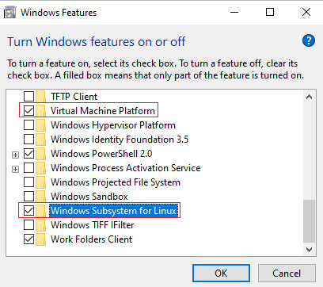
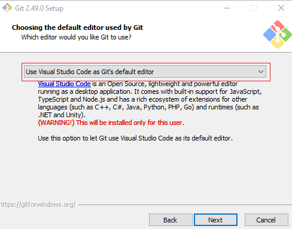
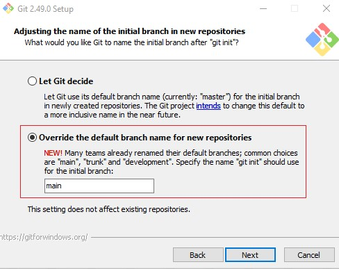
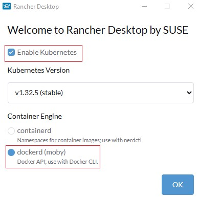
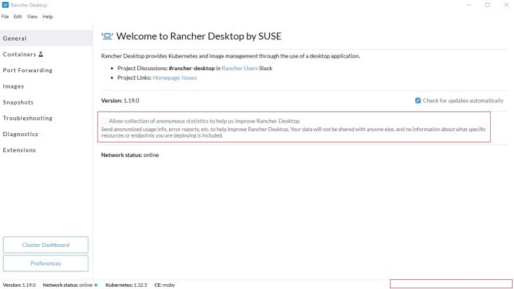
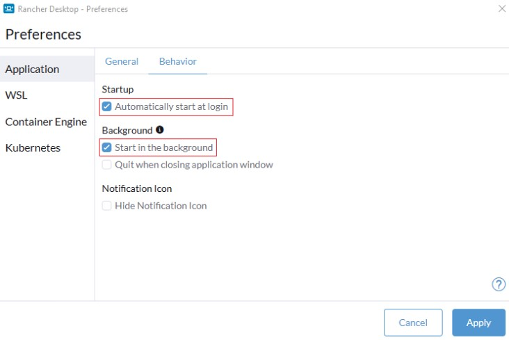
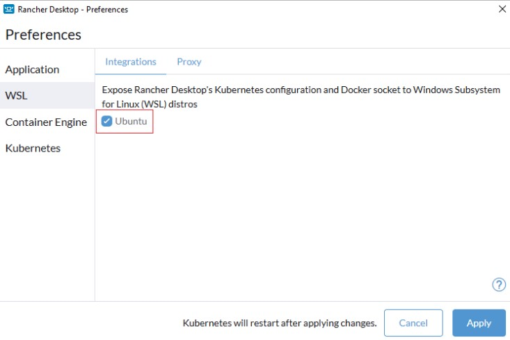

# Containerized (Linux) Development Environment Setup In Windows

## WSL
* Enable the following windows features\
  
* Restart when prompted
* Install Ubuntu app (generally the first search result for *ubuntu*) from Microsoft store\
  <ins>Note:</ins> Ubuntu default distribution for WSL can be installed using the command `wsl --install` from PowerShell (run as administrator). However, it was stuck at downloading Ubuntu in my case.
* When prompted, create default UNIX user account (e.g., ubunturoot) that can be used for *sudo* privileges
* If the launch window displays an error (e.g., Error code: Wsl/Service/CreateInstance/MountDisk/HCS/ERROR_FILE_NOT_FOUND)
* Run the following command in PowerShell to ensure WSL is running the default Ubuntu distribution
  * `wsl -l -v`
* Open Ubuntu app (terminal) and run the following commands
  * Check the Ubuntu version
    * `cat /etc/*release*`
  * Install updates
    * `sudo apt update && sudo apt upgrade`
  * Add wget (to retrieve content from web servers) and ca-certificates (to allow SSL-based applications to check for the authenticity of SSL connections)
    * `sudo apt install wget ca-certificates`
    * `sudo apt autoremove`

## Git for Windows
* Download and install *Git for Windows* with the following options (leave the rest with default options)\
  
  
  

## Rancher Desktop
* Download and install *Rancher Desktop*
* Launch *Rancher Desktop* with the following options\
  
* Wait for the intialization to complete by checking the progress at the bottom right of the window. When finished, it should be empty as shown in red box below.\
  
* Set the *Preferences* for *Rancher Desktop* as below
  * Rancher Desktop &rarr; Preferences &rarr; Application &rarr; Behavior &rarr; Startup &rarr; Automatically start at login = Checked\
    Rancher Desktop &rarr; Preferences &rarr; Application &rarr; Behavior &rarr; Background &rarr; Start in the background = Checked\
    
  * Rancher Desktop &rarr; Preferences &rarr; WSL &rarr; Integrations &rarr; Ubuntu = Checked\
    

## Windows Terminal
* Install *Windows Terminal* from Microsoft Store
* Open *Windows Terminal* and set the default profile to *WSL Ubuntu*
  * Windows Terminal &rarr; Settings &rarr; Statup &rarr; Default profile = Ubuntu
* Run the following commands in *Windows Terminal (Ubuntu Profile)*
  * Ensure docker is running in WSL
    * `docker --version`
    * `docker ps`
  * Ensure git is installed
    * `git --version`
  * Set git config
    * `git config --global user.name "Your Name"`
    * `git config --global user.email "youremail@domain.com"`
    * `git config --global init.defaultBranch main`
  * Setup GCM for WSL
    * `git config --global credential.helper "/mnt/c/Pragram\ Files/Git/mingw64/bing/git-credential-manager.exe"`

## Visual Studio Code
* Download and install *Visual Studio Code* with the following options (leave the rest with default options)\
  
* Install *Remote Development Extension Pack*
  
