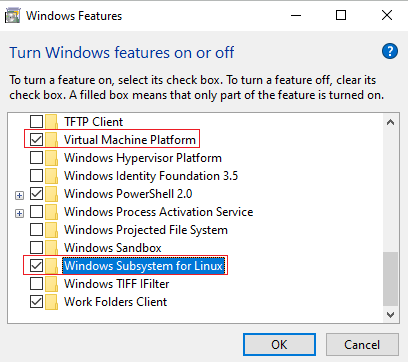
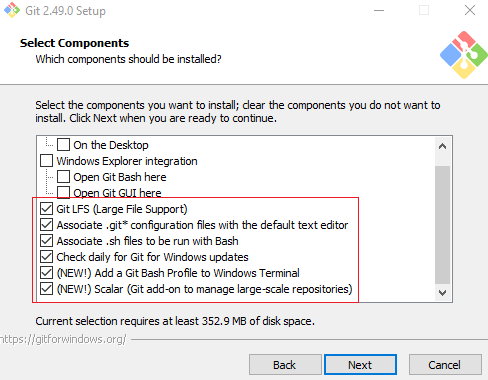
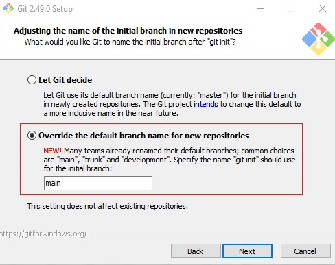

# Linux (Development) Environment Setup In Windows

## Windows Terminal
* Install *Windows Terminal* from Microsoft Store

## WSL
* Enable the following windows features  
  
* Restart when prompted
* Install Ubuntu app (generally the first search result for *ubuntu*) from Microsoft store\
  <ins>Note:</ins> Ubuntu default distribution for WSL can be installed using the command `wsl --install` from PowerShell (run as administrator). However, it was stuck at downloading Ubuntu in my case.
* When prompted, create default UNIX user account (e.g., ubunturoot) that can be used for *sudo* privileges
* Run the following command in PowerShell to ensure WSL is running the default Ubuntu distribution
  * `wsl -l -v`
* Set the default profile of Windows Terminal to WSL Ubuntu
  * Windows Terminal &rarr; Settings &rarr; Statup &rarr; Default profile = Ubuntu
* Open Windows Terminal as administrator
  * Check the Ubuntu version
    * `cat /etc/*release*`
  * Install updates
    * `sudo apt update && sudo apt upgrade`
  * Add wget (to retrieve content from web servers) and ca-certificates (to allow SSL-based applications to check for the authenticity of SSL connections)
    * `sudo apt-get install wget ca-certificates`
    * `sudo apt autoremove`

## Git for Windows
* Download and install *Git for Windows* with the following options (leave the rest with default options)
  
  
  
